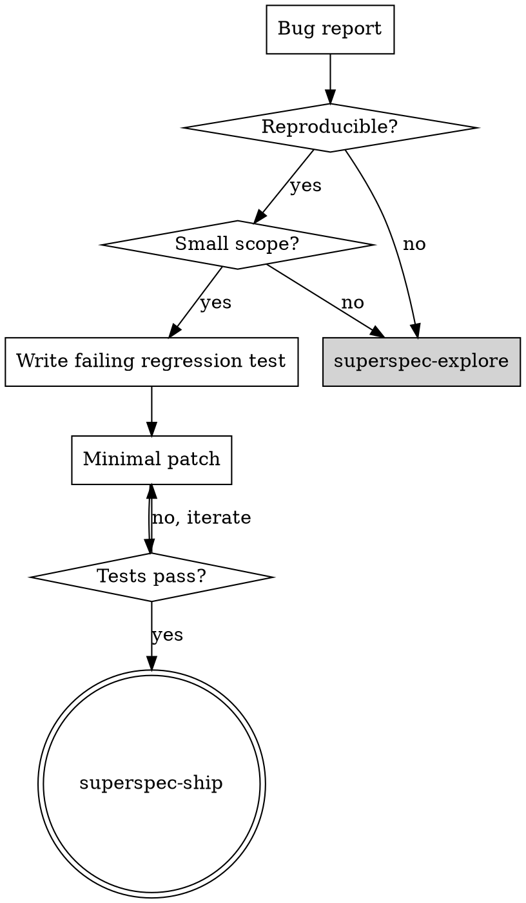

# superspec-fix

Use this skill for the **bug-fix lane** — small, well-scoped defects that can be fixed with a regression test and a minimal code change. This lane deliberately bypasses the full SuperSpec lifecycle (`spec.md`, `design.md`, `plan.md`) to keep velocity high for obvious bugs.

**Announce at start:** "I'm using the superspec-fix skill for this bug fix."

<HARD-GATE>
Do NOT create or modify `spec.md`, `design.md`, or `plan.md` in this lane. If the fix requires them, escalate to `superspec-explore` instead.
</HARD-GATE>

## When to Use

- A specific, reproducible bug with a clear expected vs actual behavior
- The fix scope is small — localized change, no new FRs, no architectural decisions
- You can write a failing regression test that captures the bug
- The user reports a defect, regression, or broken behavior in existing functionality

## When NOT to Use (Escalate)

Escalate to `superspec-explore` if any of these apply:

| Signal | Action |
|--------|--------|
| Fix requires new functional requirements or changes existing FR semantics | → `superspec-explore` |
| Root cause spans multiple subsystems or needs design decisions | → `superspec-explore` |
| No clear reproduction steps or expected behavior is ambiguous | → `superspec-explore` |
| Fix touches security, auth, data migration, or breaking API changes | → `superspec-explore` |
| Estimated change exceeds ~50 lines or 3 files (rule of thumb) | → `superspec-explore` |
| Bug reveals missing test coverage for a whole feature area | → full lifecycle for that feature |

When escalating, summarize: what you tried to reproduce, why the fix lane is insufficient, and what decisions are needed.

## What This Skill Does

1. **Reproduces the bug** — confirm actual vs expected behavior with evidence
2. **Writes a failing regression test** — test-first, capturing the defect (honors constitution Principle 1)
3. **Applies a minimal patch** — smallest change that makes the test pass
4. **Verifies** — regression test passes; existing tests still pass
5. **Hands off to ship** — `superspec-ship` for integration validation (not full `superspec-validate` matrix unless requested)

## How to Use

### Step-by-step workflow

1. **Understand the report** — gather:
   - Steps to reproduce
   - Expected behavior
   - Actual behavior
   - Environment (if relevant)

2. **Reproduce locally** — run the steps and confirm the bug. If you cannot reproduce, stop and ask for more detail. Do not write a test for an unconfirmed bug.

3. **Write a failing regression test** — before any fix code:
   - Name the test to describe the defect (e.g., `rejects empty email on signup`)
   - Test must **fail** against current code, demonstrating the bug
   - Run the test and confirm it fails for the right reason
   - Place the test alongside existing tests for the affected module

4. **Apply minimal patch** — implement the smallest change that makes the regression test pass:
   - No drive-by refactors
   - No new features or scope expansion
   - No new dependencies unless strictly required for the fix

5. **Verify green** — run:
   - The new regression test (must pass)
   - The full test suite or affected test subset (must pass)
   - Any project linters if they are fast and standard

6. **Document briefly** — in the commit message or a short fix note (not spec.md):
   - What was broken
   - What the regression test covers
   - What changed (1–2 sentences)

7. **Hand off to ship** — invoke `superspec-ship` for integration:
   - Ship runs test verification and presents merge/PR options
   - Full `superspec-validate` matrix is **not** required for fix-lane work (no plan.md to lint)
   - Constitution Principle 1 is satisfied by the regression test cycle

## Artifacts

| Created | Skipped |
|---------|---------|
| Failing then passing regression test | `spec.md` |
| Minimal code patch | `design.md` |
| Commit with fix description | `plan.md` |
| | `execution-map.md` |

## Fix Lane vs Full Lifecycle

## Handoff

| Outcome | Next skill |
|---------|------------|
| Fix complete, tests pass | `superspec-ship` — verify tests, present merge/PR options |
| Scope too large or ambiguous | `superspec-explore` — design the proper fix with full lifecycle |
| Bug reveals systemic gap | `superspec-explore` → full lifecycle for the affected feature |

## Key Principles

- **Test-first, always** — failing regression test before fix code (constitution Principle 1)
- **Minimal patch** — fix the bug, nothing else
- **No spec artifacts** — this lane skips spec.md/design.md/plan.md by design
- **Escalate early** — if the fix lane feels forced, it probably needs explore
- **Evidence before claims** — reproduce the bug, show the failing test, show green after fix
