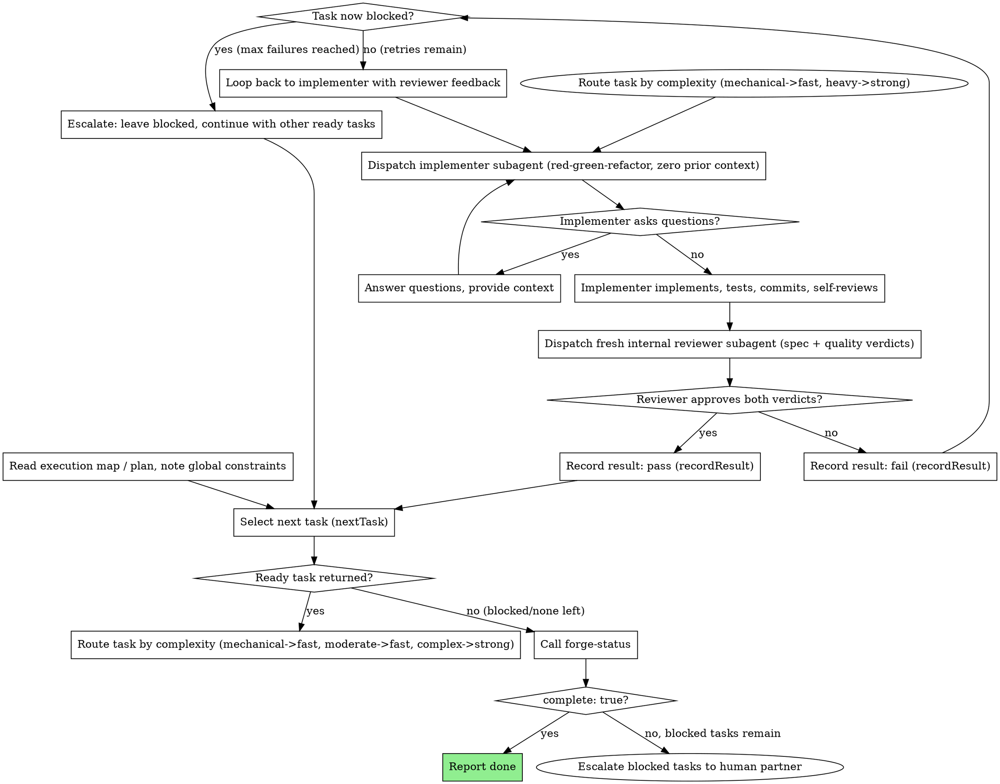

# superspec-forge: The Autonomous Implementation Loop

## Overview

You take an execution map (from superspec-route) or a task plan (from superspec-plan) and drive it to completion. Each task gets a fresh implementer subagent working red-green-refactor with zero prior context, then a fresh internal reviewer subagent that checks the result against the task's acceptance criteria and the project's constitution. Progress is tracked in forge state, not just in your own memory — so a killed and restarted session can pick up where it left off.

**Why subagents:** you delegate each task to a specialized agent with isolated context. By precisely crafting its instructions, you ensure it stays focused and succeeds. It never inherits your session's context or history — you construct exactly what it needs. This also preserves your own context for coordination work across the whole loop.

**Core principle:** `nextTask`, `recordResult`, and `forgeStatus` are the three operations of the `@superspec/core` library's forge-loop state machine (`packages/core/src/forge-loop.ts`): select a DAG-ready task -> route it by complexity -> dispatch a fresh implementer (red-green-refactor, zero prior context) -> dispatch a fresh reviewer (spec + quality verdicts) -> record the verdict -> repeat until status reports `complete: true`. Today, only `forge-status` is exposed as an MCP tool (and, as detailed below, only in its fresh-state form). `next-task` and `record-task-result` are not currently exposed as MCP tools or CLI subcommands. If you are working in a context that can run TypeScript/Node against `@superspec/core`, drive the loop by importing and calling `nextTask`/`recordResult` directly; otherwise, approximate the same logic yourself — scan the plan's tasks, pick the first one whose dependencies are all recorded as `done`, and track each task's pass/fail counts and the blocked threshold in your own ledger — until these are exposed as callable tools in a future iteration.

**Continuous execution:** do not pause to check in with your human partner between tasks. Execute all ready tasks without stopping. The only reasons to stop are: a task permanently `blocked` that you cannot resolve, ambiguity that genuinely prevents progress, or `forge-status` reporting `complete: true`. "Should I continue?" prompts waste your partner's time — they asked you to run the loop, so run it.

## Two Modes, Same Loop

This skill covers both ways of running the loop; the state machine underneath is identical either way:

- **Subagent-driven (same session):** you dispatch a fresh implementer and reviewer subagent per task, in this session, with no human turn between tasks. Fastest iteration; requires subagent support.
- **Inline execution (batch, checkpointed):** if subagents are not available, execute each task's steps yourself in strict sequence, running the same review checklist against your own output before moving on, and checkpoint with your human partner at natural batch boundaries instead of per task.

Everything below describes the subagent-driven form; where a platform lacks a native subagent construct, fall back to inline execution and treat "dispatch the implementer" as "do the work yourself" and "dispatch the reviewer" as "run the review checklist yourself before committing."

## The Forge State Machine

The loop is backed by a small, tested state machine (not a convention you have to remember correctly by hand) — implemented as the `nextTask`, `recordResult`, and `forgeStatus` functions in `packages/core/src/forge-loop.ts`. Of these, only `forge-status` is currently wired up as a callable MCP tool; `next-task` and `record-task-result` exist today as library functions you (or a future tool wrapper) call directly, not as tools you can invoke by name:

- **`nextTask`** returns the next task that is `pending` AND whose dependencies are *all* `"done"` — a task with an in-progress or merely non-pending dependency is not offered, even if that dependency isn't `"blocked"`. It returns nothing once no ready task remains.
- **`recordResult`** takes a pass/fail verdict for a task:
  - **Pass:** marks the task `done`.
  - **Fail:** increments that task's review-failure count. Once the count reaches the configured maximum, the task flips to `blocked` — permanently. This is enforced by the state machine itself: calling `recordResult` again on a task that is already `blocked` is rejected outright, not just discouraged. You cannot talk the loop into un-blocking a task by retrying; if a task is blocked, escalate it (see below) rather than looping on it.
- **`forge-status`** (the one operation exposed as an MCP tool today) reports `{ total, done, blocked, pending, complete }` for the current task set. `complete` is `true` only when every task is `done` — a run with any `blocked` task never reports complete on its own; you must resolve the blockage (fix the plan, split the task, get human input) before the loop can finish.

State is persisted to `.superspec/state.json` as you go, so a killed or restarted session can resume from disk instead of re-deriving progress from memory or re-running finished tasks. Be precise about where that resume happens today: it is a library/CLI-level capability of the forge state functions, not something the `forge-status` tool call itself guarantees — as currently exposed, that one call builds status fresh from the task/plan text rather than loading any prior saved state. If you are driving the loop through that tool directly, treat each call as evaluating the plan from scratch, and rely on your own progress ledger (or a CLI wrapper that does call the persisted-state loader) for true cross-session resume, not on that tool call alone.

## The Process

The diagram below describes the loop's logic — what to select, route, implement, review, record, and repeat until complete — which holds regardless of how you invoke it. As covered above, only `forge-status` is currently a callable MCP tool; the `next-task` / `record-task-result` steps mean "call the `@superspec/core` library functions if you can, otherwise apply the same logic yourself," not "call a tool of that name."

## Red-Green-Refactor Per Task

Every implementer dispatch follows test-driven development inline — this is not a separate skill to invoke, it's the discipline embedded in every task the loop dispatches:

1. **Red:** write the failing test for this task's acceptance criteria first. Run it, confirm it fails for the right reason.
2. **Green:** write the minimum code to make the test pass. Run it, confirm it passes.
3. **Refactor:** clean up the implementation and the test without changing behavior. Re-run to confirm still green.
4. **Self-review, commit.**

An implementer that skips straight to code without a red step, or that reports success without having run the test, has not satisfied the task — the reviewer should catch this and fail spec compliance.

## Model Selection

Route every task through `route-model` before dispatch. The rule is mechanical, not judgment-based:

- **`complexity: "mechanical"`** (isolated functions, clear specs, deterministic transformations) -> fast model.
- **`complexity: "moderate"`** (multi-file refactoring, straightforward feature work, structured changes) -> fast model.
- **`complexity: "complex"`** (multi-file coordination, design judgment, system-wide implications) -> strong model.

Apply the same rule to the reviewer: a small mechanical diff does not need the strongest model to review; a heavy task's diff does.

**Always specify the model explicitly when dispatching a subagent.** An omitted model inherits your session's default — often the most capable and most expensive — which silently defeats the routing rule.

## The Internal Review Loop

After the implementer reports done, dispatch a fresh internal reviewer subagent — the same role that `task-reviewer` (a dedicated subagent body, not yet written as of this skill but referenced by name for when it exists) is meant to fill. Until then, construct the reviewer prompt yourself with:

- The task's acceptance criteria, copied verbatim from the plan or execution map — not paraphrased.
- The project's constitution / global constraints, copied verbatim.
- The diff or commit range the implementer produced.
- Instructions to return **two independent verdicts**: spec compliance (did it build exactly what was asked, nothing more, nothing less) and code quality (is it well-built, tested, free of obvious defects).

**Both verdicts are required.** Never accept a reviewer report that only addresses one. Never let implementer self-review substitute for this independent pass — both exist because they catch different things.

On failure, send the reviewer's findings back to the *same* implementer subagent context as a follow-up dispatch (not a fresh one — it already has the working context for this task) with the specific findings to fix. Re-review after every fix. Do not move on to the next task while a review has open findings — either it resolves (record `passed: true`) or it exhausts retries and blocks (record `passed: false` until blocked).

## Stuck-Task Escalation

A task becomes permanently `blocked` after repeated review failures — this is the loop's guarantee against retrying forever on a task that cannot succeed as specified. When a task blocks:

1. **Do not retry it.** The state machine will reject further `recordResult` calls against it (whether invoked via the library or approximated by hand); treat that rejection — or your own manual re-check that it's blocked — as confirmation you should stop, not as a bug to route around.
2. **Keep going on everything else.** Select the next ready task again (via `nextTask` or your manual scan) — other DAG-ready tasks whose dependencies don't include the blocked one are still eligible and should proceed.
3. **Surface the blockage to your human partner** once no more ready tasks remain (i.e., `forge-status` shows `pending > 0` or `blocked > 0` but not `complete`). Bring the task's acceptance criteria, the reviewer's repeated findings, and your own assessment of why it kept failing (ambiguous spec, wrong dependency, task too large). Let the human decide: re-scope the task, split it, or change the plan — don't guess and don't force another retry yourself.
4. **Never treat "all remaining tasks are blocked or waiting on a blocked dependency" as done.** `forge-status`'s `complete` field is the only source of truth for "finished"; a quiet session with nothing left to dispatch is not the same as `complete: true`.

## Durable Progress

Conversation memory does not survive compaction. Track progress in the persisted forge state (`.superspec/state.json`) plus a short ledger of what happened per task (which model implemented it, review outcome, commit range) — after a compaction or restart, trust the saved state and `git log` over your own recollection, and resume at the first task `nextTask` (or your manual dependency scan) actually offers rather than re-deriving where you left off from memory.

## Common Mistakes

**Wrong:** retrying a blocked task by calling `recordResult` again with a different verdict, hoping it un-blocks. **Right:** the call is rejected (or, if you're approximating the state machine by hand, you must honor that same rule yourself); escalate instead.

**Wrong:** treating `forge-status`'s fresh-from-plan-text call as if it reflects a resumed session's on-disk progress. **Right:** know that this particular call rebuilds state from the plan text each time — real cross-session resume relies on the persisted state file being loaded, which happens at the library/CLI level, not inside that call.

**Wrong:** accepting a reviewer report with only a quality verdict and no spec verdict (or vice versa). **Right:** both verdicts are mandatory; an incomplete report is not a pass.

**Wrong:** dispatching the next task's implementer while the current task still has open review findings. **Right:** resolve to `done` or `blocked` before advancing.

**Wrong:** reusing one implementer subagent's context across multiple unrelated tasks to save dispatch overhead. **Right:** one fresh implementer per task — cross-task context pollution is exactly what fresh dispatch avoids.

## Red Flags

**Never:**
- Retry an already-blocked task, or interpret a rejected (or manually-detected) `recordResult` outcome as something to work around
- Skip either review verdict (spec compliance AND code quality are both required every time)
- Move to the next task while the current one has open, unresolved review findings
- Let implementer self-review stand in for the independent reviewer subagent
- Claim `complete` because nothing is left to dispatch — only `forge-status`'s `complete: true` counts
- Assume the `forge-status` tool call reflects a resumed session's saved progress
- Dispatch a subagent without an explicit model — an omitted model silently defeats the routing rule

## Integration

**Upstream:** superspec-route produces the execution map (or superspec-plan produces the task plan) this skill executes.

**Downstream:** once `forge-status` reports `complete: true`, hand off to superspec-validate to confirm coverage-matrix status and run final gates.

---

<!-- Adapted from SP: skills/subagent-driven-development/SKILL.md (MIT) and skills/executing-plans/SKILL.md (MIT), fused with TDD discipline; the next-task/record-task-result/forge-status state-machine design (implemented in @superspec/core's forge-loop.ts) is new to SuperSpec. See /NOTICE. -->
