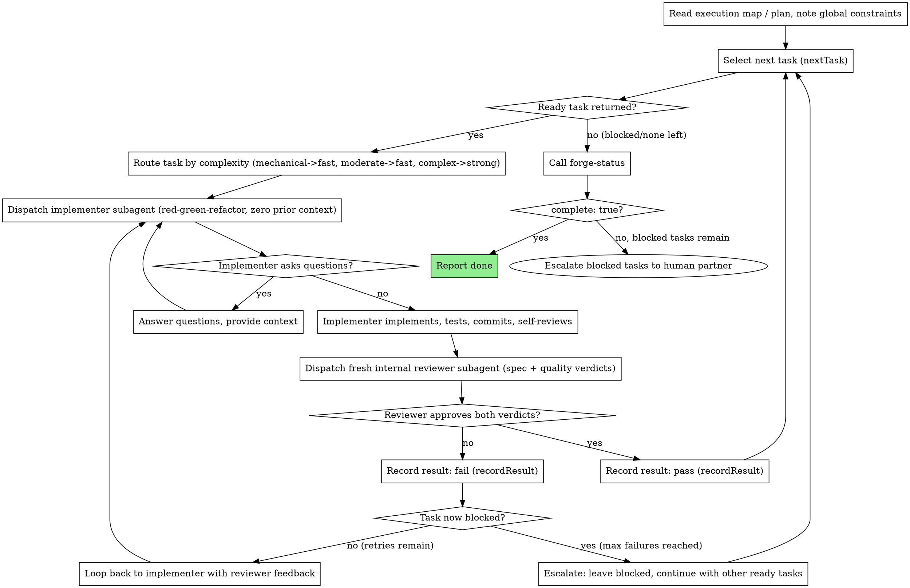

# superspec-forge: The Autonomous Implementation Loop

## Overview

You take an execution map (from superspec-route) or a task plan (from superspec-plan) and drive it to completion. Each task gets a fresh implementer subagent working red-green-refactor with zero prior context, then a fresh internal reviewer subagent that checks the result against the task's acceptance criteria and the project's constitution. Progress is tracked in forge state, not just in your own memory — so a killed and restarted session can pick up where it left off.

**Why subagents:** you delegate each task to a specialized agent with isolated context. By precisely crafting its instructions, you ensure it stays focused and succeeds. It never inherits your session's context or history — you construct exactly what it needs. This also preserves your own context for coordination work across the whole loop.

**Core principle:** `nextTask`, `recordResult`, `markInProgress`, `forgeStatus`, and `sync-status` are the forge operations exposed by `@superspec-dev/core` (CLI + MCP). Each spec directory keeps:

- `specs/<feature>/.superspec/state.json` — machine state (gitignored)
- `specs/<feature>/status.md` — **committed FR + task status table** (updated by `sync-status` / `record-result --spec`)

Also use **TodoWrite** for in-session task visibility (same pattern as Superpowers `subagent-driven-development`).

**Continuous execution:** do not pause to check in with your human partner between tasks. Execute all ready tasks without stopping. The only reasons to stop are: a task permanently `blocked` that you cannot resolve, ambiguity that genuinely prevents progress, or `forge-status` reporting `complete: true`. "Should I continue?" prompts waste your partner's time — they asked you to run the loop, so run it.

## Two Modes, Same Loop

This skill covers both ways of running the loop; the state machine underneath is identical either way:

- **Subagent-driven (same session):** you dispatch a fresh implementer and reviewer subagent per task, in this session, with no human turn between tasks. Fastest iteration; requires subagent support.
- **Inline execution (batch, checkpointed):** if subagents are not available, execute each task's steps yourself in strict sequence, running the same review checklist against your own output before moving on, and checkpoint with your human partner at natural batch boundaries instead of per task.

Everything below describes the subagent-driven form; where a platform lacks a native subagent construct, fall back to inline execution and treat "dispatch the implementer" as "do the work yourself" and "dispatch the reviewer" as "run the review checklist yourself before committing."

## The Forge State Machine

The loop is backed by `packages/core/src/forge-loop.ts` and `packages/core/src/fr-status.ts`. Callable via CLI/MCP:

| Operation | CLI / MCP | Purpose |
|-----------|-----------|---------|
| `next-task` | ✓ | Next DAG-ready pending task |
| `begin-task` | ✓ | Mark task `in_progress` |
| `record-result` | ✓ | Pass/fail verdict; pass `--spec` to refresh `status.md` |
| `sync-status` | ✓ | Write `status.md` from spec + plan + state |
| `forge-status` | ✓ | Aggregate counts; pass `stateDir` to load persisted state |

State persists to `specs/<feature>/.superspec/state.json`. FR-level status persists to `specs/<feature>/status.md` (commit this file).

## The Process

The diagram below describes the loop's logic — what to select, route, implement, review, record, and repeat until complete. All forge operations are available via CLI and MCP; always pass `--dir` / `stateDir` so persisted state loads.

```bash
npx @superspec-dev/core next-task --plan specs/<feature>/plan.md --dir specs/<feature> --verbose
npx @superspec-dev/core begin-task --plan specs/<feature>/plan.md --dir specs/<feature> --task T001 --verbose
npx @superspec-dev/core record-result --plan specs/<feature>/plan.md --dir specs/<feature> --task T001 --passed true --spec specs/<feature>/spec.md --verbose
```

MCP `next-task`, `begin-task`, and `record-result` are verbose by default (human summary + JSON).



## Dispatching With a Discovered Persona

The "Dispatch implementer subagent" step above is a single node in the diagram, but what identity you construct for that dispatch depends on how the task's persona was assigned. superspec-route's persona-assignment step attaches each execution-map window a persona in one of two forms: the real `name` of a persona that `list-personas` discovered in the target project (e.g. `"backend-developer"`), or, when discovery found nothing suitable, one of the fixed generic `@`-prefixed fallback roles (e.g. `@backend`). Before dispatching the implementer for a task, check which form its assigned persona is in:

- **Assigned persona matches a name `list-personas` actually discovered:** in addition to the task's own zero-prior-context brief, layer that persona's declared identity on top of it. Read the persona's description from its own file (the `path` field `list-personas` returned for it), and fold that description into the framing you give the implementer so it carries that persona's declared expertise and responsibilities, not just the task instructions. If your current environment's own subagent-dispatch mechanism supports invoking a specifically named custom agent (many agent-capable tools do, but this is a capability of the environment, not something this skill can assume exists everywhere), use that mechanism to dispatch the implementer as that named agent. If it does not — or you're not sure — the fallback always works: read the persona's file yourself and paste its description into the task brief as ordinary prompt context, exactly as you would fold in any other piece of context. The zero-prior-context discipline still applies to everything else — the persona's description is the one piece of standing context this dispatch is allowed to carry in.
- **Assigned persona is a generic `@`-prefixed fallback role, or no persona was assigned:** dispatch a generic implementer exactly as described elsewhere in this skill — no identity layering, no change to today's behavior.

Do not assume a specific mechanism for "invoke a named custom agent" exists — describe what you need (an implementer with this persona's identity, working this task, with zero other prior context) and use whichever native construct your environment offers, or the manual fold-in-the-description fallback when it offers none.

## Red-Green-Refactor Per Task

Every implementer dispatch follows test-driven development inline — this is not a separate skill to invoke, it's the discipline embedded in every task the loop dispatches:

1. **Red:** write the failing test for this task's acceptance criteria first. Run it, confirm it fails for the right reason.
2. **Green:** write the minimum code to make the test pass. Run it, confirm it passes.
3. **Refactor:** clean up the implementation and the test without changing behavior. Re-run to confirm still green.
4. **Self-review, commit.**

An implementer that skips straight to code without a red step, or that reports success without having run the test, has not satisfied the task — the reviewer should catch this and fail spec compliance.

## Model Selection

Route every task through `route-model` before dispatch. The rule is mechanical, not judgment-based:

- **`complexity: "mechanical"`** (isolated functions, clear specs, deterministic transformations) -> fast model.
- **`complexity: "moderate"`** (multi-file refactoring, straightforward feature work, structured changes) -> fast model.
- **`complexity: "complex"`** (multi-file coordination, design judgment, system-wide implications) -> strong model.

Apply the same rule to the reviewer: a small mechanical diff does not need the strongest model to review; a complex task's diff does.

**Always specify the model explicitly when dispatching a subagent.** An omitted model inherits your session's default — often the most capable and most expensive — which silently defeats the routing rule.

## The Internal Review Loop

After the implementer reports done, dispatch a **fresh, independent reviewer** — never the same context that wrote the code. SuperSpec ships the reviewer body at **`agents/task-reviewer.md`** (plugin root; copy to `.claude/agents/task-reviewer.md` or `.cursor/agents/task-reviewer.md` in target projects if your platform resolves agents by path).

Fill the template placeholders before dispatch:

| Placeholder | Source |
|-------------|--------|
| `[TASK_NAME]`, `[FR_NUMBER]`, `[ACCEPTANCE_CRITERIA]` | Current task from plan / execution map — **verbatim** |
| Constitution block | `constitution.md` at repo root — **verbatim** |
| `[BASE_SHA]..[HEAD_SHA]` | Commit range the implementer produced |
| `[DIFF_FILE]` or inline diff | `git diff BASE..HEAD` |

The reviewer returns **two independent verdicts** in one report (adapted from Superpowers' two-stage review, combined into one pass):

1. **Spec compliance** — built exactly what was asked; test-first honored; traceability intact.
2. **Code quality** — well-built, tested, maintainable; issues cited with `file:line`.

**Both verdicts are required.** Never accept a report with only one. Never let implementer self-review substitute for this pass.

**Pass criteria:** both verdicts ✅ (or "Approved" / "Compliant" / "High quality" per the template). Anything else is a fail.

**On failure:** send findings to the **same** implementer context (resume, don't respawn) with specific fixes. Re-dispatch `task-reviewer` after every fix. Do not call `next-task` while review is open.

**On pass:** `record-result --passed true --spec specs/<feature>/spec.md` then `sync-status`.

**On repeated failure:** `record-result --passed false` (state machine allows up to 3 review failures, then `blocked`).

## Per-Task Dispatch Playbook (Claude Code & Cursor)

The forge coordinator runs this loop per task. **Before the loop**, run forge start (once). Steps 0–9 below are per-session; steps 1–9 repeat per task.

### Forge start (once, before first task)

```text
0. sync-status --verbose   → write specs/<feature>/status.md from spec + plan + state
   npx @superspec-dev/core sync-status --spec specs/<feature>/spec.md --plan specs/<feature>/plan.md --dir specs/<feature> --verbose
```

Call step 0 at forge kickoff (after plan-phase approval in review mode, or immediately in autonomous mode). TodoWrite todos from the plan should also be created here.

### Shared steps (every platform, per task)

```text
1. route-model          → pick fast/strong for implementer AND reviewer
2. next-task --verbose  → load persisted state from specs/<feature>/
3. begin-task --task T00X --verbose
4. [DISPATCH IMPLEMENTER — see platform section below]
5. [DISPATCH task-reviewer — fresh context, readonly]
6. If review fails → resume implementer with findings → back to 5
7. record-result --passed true --spec specs/<feature>/spec.md --verbose
8. sync-status --verbose (or forge-status --spec …)
9. forge-status --dir specs/<feature> --verbose → check complete
```

Implementer prompt body: **`agents/implementer.md`**. Reviewer prompt body: **`agents/task-reviewer.md`**. Layer a discovered persona on the implementer only (see "Dispatching With a Discovered Persona" above).

MCP equivalents: `next-task`, `begin-task`, `record-result` (pass `specText` + `specDir` to refresh `status.md`), `sync-status`, `forge-status` — always pass `stateDir` / `--dir specs/<feature>`.

### Claude Code

Claude Code has native **isolated subagent dispatch** via the `Agent` tool. See `references/claude-code-tools.md`.

**Implementer** — fresh agent, zero prior forge context:

```text
Agent({
  prompt: """
  You are the implementer. Follow agents/implementer.md discipline.

  [Paste filled implementer.md with TASK_NAME, FR, acceptance criteria, constitution excerpt]

  Red-green-refactor. Run tests. Commit. Report BASE_SHA and HEAD_SHA.
  """,
  model: "<routed implementer model>"
})
```

If the task's persona was discovered via `list-personas`, dispatch as that named `.claude/agents/<name>.md` agent when available; otherwise fold the persona description into the prompt.

**Reviewer** — fresh agent, **read-only**, different model than implementer:

```text
Agent({
  prompt: """
  You are task-reviewer. Follow agents/task-reviewer.md exactly.
  Read-only — do not modify files.

  [Paste filled task-reviewer.md with task brief, constitution, diff, commit range]

  Return spec compliance AND code quality verdicts.
  """,
  model: "<routed reviewer model>"
})
```

**Fix loop:** resume the **same** implementer agent with reviewer findings; do not spawn a new implementer until the task passes or blocks.

### Cursor

Cursor supports isolated work via the **`Task` tool** (subagent dispatch). See `references/cursor-tools.md`. When `Task` is unavailable, use the inline fallback at the end of this section.

**Implementer:**

```text
Task({
  subagent_type: "generalPurpose",   // or a discovered .cursor/agents/<persona> if applicable
  model: "<routed implementer model>",
  description: "Implement T00X",
  prompt: """
  Follow agents/implementer.md. Zero prior context except the task brief below.

  [Filled implementer.md: task, FR, acceptance criteria, constitution]

  TDD: red → green → refactor. Run tests. Commit. Return BASE_SHA..HEAD_SHA and summary.
  """
})
```

**Reviewer** — must be a **separate** dispatch with **no implementer conversation history**:

```text
Task({
  subagent_type: "code-reviewer",    // or generalPurpose with task-reviewer.md pasted
  model: "<routed reviewer model>",
  readonly: true,
  description: "Review T00X",
  prompt: """
  Follow agents/task-reviewer.md. Read-only.

  [Filled task-reviewer.md: acceptance criteria, constitution, git diff, commits]

  Both verdicts required: spec compliance + code quality.
  """
})
```

**Fix loop:** `Task({ resume: "<implementer-agent-id>", prompt: "Fix these review findings: …" })` then re-run the reviewer `Task` with a fresh dispatch.

**Personas:** `list-personas` scans `.cursor/agents/` and `.claude/agents/`. Use discovered names in `subagent_type` when the platform exposes them; otherwise paste persona description into the implementer prompt.

### Inline fallback (either platform)

When subagent/`Task` dispatch is unavailable, the coordinator implements and reviews **in one session** but must still enforce separation of concerns:

1. Implement using `implementer.md` discipline (TDD, commit).
2. **Stop.** Open a new message or explicit "review mode" boundary.
3. Apply `task-reviewer.md` checklist against the diff **as if you were a different reviewer** — do not rationalize your own choices.
4. Only then call `record-result`.

This is slower and easier to cheat; prefer isolated dispatch on both Claude Code and Cursor when the tooling exists.

## Stuck-Task Escalation

A task becomes permanently `blocked` after repeated review failures — this is the loop's guarantee against retrying forever on a task that cannot succeed as specified. When a task blocks:

1. **Do not retry it.** The state machine will reject further `recordResult` calls against it (whether invoked via the library or approximated by hand); treat that rejection — or your own manual re-check that it's blocked — as confirmation you should stop, not as a bug to route around.
2. **Keep going on everything else.** Select the next ready task again (via `nextTask` or your manual scan) — other DAG-ready tasks whose dependencies don't include the blocked one are still eligible and should proceed.
3. **Surface the blockage to your human partner** once no more ready tasks remain (i.e., `forge-status` shows `pending > 0` or `blocked > 0` but not `complete`). Bring the task's acceptance criteria, the reviewer's repeated findings, and your own assessment of why it kept failing (ambiguous spec, wrong dependency, task too large). Let the human decide: re-scope the task, split it, or change the plan — don't guess and don't force another retry yourself.
4. **Never treat "all remaining tasks are blocked or waiting on a blocked dependency" as done.** `forge-status`'s `complete` field is the only source of truth for "finished"; a quiet session with nothing left to dispatch is not the same as `complete: true`.

## Durable Progress

Conversation memory does not survive compaction. Track progress in **three layers**:

1. **TodoWrite** — create todos from the plan at forge start; mark `in_progress` / `completed` per task (Superpowers pattern).
2. **`specs/<feature>/status.md`** — FR-level table (`pending` / `in_progress` / `done` / `blocked`). Refresh via:
   ```bash
   npx @superspec-dev/core sync-status --spec specs/<feature>/spec.md --plan specs/<feature>/plan.md --dir specs/<feature> --verbose
   ```
   Or MCP `sync-status` (verbose by default). Call after `begin-task`, `record-result`, and at forge start.
   For a quick forge checkpoint without a separate sync call:
   ```bash
   npx @superspec-dev/core forge-status --plan specs/<feature>/plan.md --dir specs/<feature> --spec specs/<feature>/spec.md --verbose
   ```
3. **`specs/<feature>/.superspec/state.json`** — machine forge state. Always pass `--dir specs/<feature>` (or `stateDir`) to forge MCP/CLI tools.

After compaction or restart, trust `status.md`, `state.json`, and `git log` — not memory.

## Common Mistakes

**Wrong:** retrying a blocked task by calling `recordResult` again with a different verdict, hoping it un-blocks. **Right:** the call is rejected (or, if you're approximating the state machine by hand, you must honor that same rule yourself); escalate instead.

**Wrong:** treating `forge-status` without `stateDir` as resumed progress. **Right:** pass `stateDir` / `--dir` so persisted state loads.

**Wrong:** relying only on TodoWrite with no `status.md`. **Right:** refresh `status.md` after every state change so FR progress is visible in the repo.

**Wrong:** accepting a reviewer report with only a quality verdict and no spec verdict (or vice versa). **Right:** both verdicts are mandatory; an incomplete report is not a pass.

**Wrong:** dispatching the next task's implementer while the current task still has open review findings. **Right:** resolve to `done` or `blocked` before advancing.

**Wrong:** recording `passed: true` without a `task-reviewer` pass (implementer self-review only). **Right:** always dispatch reviewer per playbook above, then `record-result`.

**Wrong:** reusing one implementer subagent's context across multiple unrelated tasks to save dispatch overhead. **Right:** one fresh implementer per task — cross-task context pollution is exactly what fresh dispatch avoids.

## Red Flags

**Never:**
- Retry an already-blocked task, or interpret a rejected (or manually-detected) `recordResult` outcome as something to work around
- Skip either review verdict (spec compliance AND code quality are both required every time)
- Move to the next task while the current one has open, unresolved review findings
- Let implementer self-review stand in for `agents/task-reviewer.md`
- Call `record-result --passed true` without a completed reviewer report
- Claim `complete` because nothing is left to dispatch — only `forge-status`'s `complete: true` counts
- Assume the `forge-status` tool call reflects a resumed session's saved progress
- Dispatch a subagent without an explicit model — an omitted model silently defeats the routing rule

## Integration

**Upstream:** superspec-route produces the execution map (or superspec-plan produces the task plan) this skill executes.

**Downstream:** when `forge-status` reports `complete: true`, follow execution mode from `using-superspec`:

**Review mode (default):** Present implementation summary + `status.md`. Wait for approval before validation.

> "Forge complete — all tasks done. Review `status.md` and the diff. Reply when ready to run validation."

Then invoke **`superspec-validate`**.

**Autonomous mode:** invoke **`superspec-validate`** immediately when `complete: true`.

---

<!-- Adapted from SP: skills/subagent-driven-development/SKILL.md (MIT) and skills/executing-plans/SKILL.md (MIT), fused with TDD discipline; the next-task/record-task-result/forge-status state-machine design (implemented in @superspec-dev/core's forge-loop.ts) is new to SuperSpec. See /NOTICE. -->
